[](https://github.com/sponsors/intelligentiaomni)


## GROVE a UNIX for AI-Augmented Scientific Discovery

A unified scientific OS and reasoning engine to advance science. Transforming bottlenecked research processes into a high-leverage computational system, efficient workflows, and velocity. 

This is how we build the next era of R&D Labs.<br>
This is how we leverage frontier science.<br>
This is how we push civilization forward.<br>

---
## TL;DR

**GROVE** is a **scientific operating system**, a **reasoning engine**, and a **continuous discovery platform**, to progress science via predictable output: insights, discoveries, optimized designs, validated experiments, and decisions. It's built from first principles of AI and human collaboration, integrated in an architecture that is intentionally generalizable and future-facing, signaling a path toward **autonomous, computationally evidence-driven, AI-native modality unification**. GROVE fuses text, data, code, and simulations into a unified reasoning workflow today, with future arcs toward joint embeddings and fully automated simulation↔language loops.

---

## Scientific Architecture

A full-stack open-source system that ties together reasoning, computation, visualization, simulations, and collaboration.

* **Rust:** performance, deterministic orchestration, simulations, safety.
* **Python:** ML runtime (PyTorch), data pipelines, embeddings, notebooks.
* **TypeScript / Next.js:** dashboards, interaction layers, visualization.
* **WASM / WebGPU:** real-time visualizations + browser-based simulation kernels.
* **PyTorch:** training, fine-tuning, multimodal embeddings, differentiable modeling.
* **ONNX** Runtime: portable deployment of models across Rust, Python, and browser.
* **Git LFS** + datasets: versioned scientific and experimental assets.
* **APIs** + agent endpoints: modular and extensible system commands.
* Rust → WASM → Browser: compile simulation + inference into the UI.

### System-Level Goals

* A **programmable, modular OS** for scientific reasoning.
* Language-agnostic, composable toolkit for computational research.
* Local or cloud execution pathways.

---

## Continuous Discovery Engine

Multimodal, evidence-driven AI pipelines, conducting continuously self-improving discovery feedback iterations.

* **Multimodal reasoning:** text, code, data, simulations, spatial, visual inputs.
* **Hypothesis engine:** proposes, refines, compares research directions.
* **Reproducibility:** every experiment logged, variantable, auditable.
* **Evidence fusion:** literature, data streams, simulations, experiments.
* **Tradeoff visualizer:** navigate multi-dimensional scientific spaces.
* **Literature Triangulation:** conceptual, cross-disciplinary, multi-language extraction.   
* **Foresight modules:** explore counterfactuals and plausible research pathways.
* **R&D automations:** run iterative loops, generate experiment variants, evaluate.
* **Cross-disciplinary generalization:** supports a wide range of scientific domains.
* **Multi-team collaboration:** shared memory, syncing, real-time co-exploration.

### Engine Goals

* Robust error analysis and uncertainty quantification. 
* Fast, inexpensive *pre-validation* of scientific ideas.  
* Cognitive-science-inspired hypothesis mapping.

---

### Long-term arc

* Builds toward **generalized reasoning, automatic workflows + data-driven research automation**.

---

## Testing, Simulations, Digital Twins

Builder Game becomes an asset for experimentation and conceptual testing.

* Rust compute kernels → Python embeddings → multimodal reasoning → UI fusion.
* **Digital twins** of materials, processes, and scientific scenarios.
* Test unconventional ideas in controlled virtual environments.

### Purpose

* Explore full scientific iterations end-to-end at research-grade depth.<br> 
* Combine disparate features or data modalities.<br>
* Examine how compute, time, complexity, or question-framing affects outcomes.<br>
* Real-time multi-user collaboration and feedback loops.<br>
* A portal into the “future lab” experience.<br>

---

### Outcome

* Lab becomes machine ⇾ predictable, continuous, and 100× more efficient.<br>
* Conducts the next major science paradigm.<br>
* Multiplies creativity, knowledge, and insight.<br>

---

### Support GROVE

GROVE is open-source and community-driven.  
You can support sustainable research and development at:

**GitHub Sponsors:** https://github.com/sponsors/intelligentiaomni  
**PayPal (legacy):** https://paypal.me/principia-lab

---

### Architecture Diagram

Shows the core engine, multimodal layers, reasoning agents, and Builder Game integration.

[Open Architecture Diagram (.mmd)](docs/architecture.mmd)




---

### Directory structure
```
grove/
├── README.md
├── LICENSE

################################################################################
# CORE (Reasoning + Evidence)
################################################################################

├── core/
│   ├── extractor/		            # The selection pressure
│   │   ├── extractor.py	   
│   │   ├── mutation.py	
│   │   ├── novelty.py	
│   │   ├── population.py
│   │   ├── scoring.py
│   │   └── selection.py
│   ├── insight/	                # Prevents intellectual self-deception
│   │   ├── adaptive_control.py
│   │   ├── effective_action.py
│   │   ├── decisions.py
│   │   ├── metrics.py
│   │   ├── predictions.py
│   │   ├── regulatory_adequacy.py 
│   │   ├── structural_variety.py 
│   │   └── epistemic_viability.py
│   ├── theory/
│   │   ├── stabilization.py
│   │   └── compression.py
│   ├── storage/
│   │   ├── interface.py
│   │   ├── filesystem_store.py
│   │   ├── sqlite_store.py
│   │   ├── vector_store.py
│   ├── reasoning/                  # Multi-step reasoning, planners, chains
│   │   ├── chains/                 # Reusable chain modules
│   │   ├── planners/               # Hypothesis, experiment, task planners
│   │   └── evaluators/             # Reasoning-level metrics
│   ├── simulator/                  # Digital twin + physics/chem sims
│   │   ├── physics/                # Wave, diffusion, FEM, MD, etc.
│   │   ├── chemistry/              # Reaction modeling, force-fields
│   │   └── workflows/              # Simulation workflows/templates
│   ├── tradeoff_visualizer/        # Frontier mapping
│   ├── literature_triangulation/   # Literature triangulation engine 
│   └── evidence/                   # Validation + diagnostics    
│       ├── metrics/                # Metrics, diagnostics, scorecards
│       │   ├── robustness_auc.py
│ 	    │   └── robustness_mae.py     
│       └── validators/             # Statistical/ML validators
│           ├── robustness.py
│           └── threshold_crossing.py
├── __init__.py

################################################################################
# AI ENGINE (Continuous Discovery Engine)
################################################################################

├── engine/
│   ├── engine-core/                # Kernel: compute graph + primitives
│   │   ├── src/
│   │   │   ├── lib.rs
│   │   │   └── compute/            # Wavefields, sieve, transforms, etc.
│   │   └── Cargo.toml
│   ├── engine-ml/                  # ML inference / adapters
│   │   └── src/inference.rs
│   ├── engine-server/              # Native Rust server (Axum/Actix)
│   │   └── src/main.rs
│   ├── engine-wasm/                # WASM interface for browser
│   │   └── src/lib.rs
│   ├── engine-mm/                  # Multimodal scaffolding layer
│   ├── vision/                     # CLIP/EVA/vision encoders
│   ├── sequences/                  # Sequence embeddings (primes, signals)
│   ├── wavefields/                 # Wavefield encoders / solvers
│   └── fusion/                     # Multimodal fuser / integrator

################################################################################
# DATA (State)
################################################################################

├── RAM
├── logs
├── theory

################################################################################
# EXPERIMENTS + PIPELINES 	    
################################################################################

├── experiments/
│   ├── 2025-11-rothko-wasm
│   ├── 2025-11-wavefield-sieve     # Example timestamped experiment
│   │   ├── code/                   # Scripts calling engine-core/server
│   │   └── data/                   # Outputs (Git LFS recommended)
│   └── pipelines/                  # End-to-end research pipelines
│       ├── results/                # Aggregated results
│       └── robustness_eval/
│           ├── capsule/	    
│           │   ├── config.yaml
│           │   ├── environment.lock.yaml
│           │   ├── commit.txt
│           │   └── pipeline.yaml
│           ├── hypotheses/
│           ├── notebooks/
│           │   ├── .ipynb_checkpoints
│           │   └── robustness_analysis.ipynb
│           ├── outputs/
│           │   ├── figures/
│           │   ├── metrics.json
│           │   ├── report.pdf
│           │   └── bibliography.bib
│           ├── results/
│           ├── src/
│           │   ├── run.py
│           │   └── analysis.py            
│           ├── build.ps1
│           ├── README.md       
│           └── triggers/           # Auto-run triggers (events, commits)
├─ syntheses/  
├─ foundations/
│  │  └─ cybernetics.md
│  └─ meta/
│     ├─ agent.md            	    # Epistemic stance (v0.1)
│     └─ regression.md      	    # Guardrails against self-deception

################################################################################
# SIMULATIONS + DIGITAL TWIN ENVIRONMENT
################################################################################

├── simulations/
│   └── digital-twin/
│       ├── config.yaml
│       ├── simulator/
│       └── docs/

################################################################################
# BUILDER GAME (Learning & Experiment Sandbox)
################################################################################

├── builder_game/
│   ├── scenarios/                  # Playable scientific scenarios
│   ├── sims/                       # Physics-driven gameplay
│   └── evals/                      # Feedback loops & scoring

################################################################################
# PLATFORM 
################################################################################

├── platform/
│   ├── api/	                    
│   ├── dashboard/                  # Web UI modules 
│   ├── auth/                 
│   └── sync/                     

################################################################################
# APPLICATIONS (User Interfaces)
################################################################################

├── apps/
│   ├── web/                        # Next.js app (Vercel)
│   └── cli/                        # Rust CLI wrapper for engine

################################################################################
# SCRIPTS, TESTS, DOCS
################################################################################

├── scripts/
│   ├── deploy/                     # Deployment helpers
│   └── automation/                 # Cron, batch jobs
├── tests/
│   ├── unit/
│   ├── integration/
│   └── evidence/                   # Evidence-driven tests
├── docs/
│   ├── architecture/               # Kernel/engine/system diagrams
│   ├── modules/                    # Specs for each subsystem
│   └── roadmap/                    # Hackathon phases, milestones

################################################################################
# WEB / FRONTEND 
################################################################################

├── assets/                         # Shared static assets (svg, models, etc.)
├── lib/                            # Shared TS utilities
├── components/                     # React components
├── pages/                          # Next.js pages
├── public/                         # Static files
├── styles/                         # Global CSS/Tailwind
├── config/                         # Env configs

################################################################################
# ENVIRONMENT (Runtime config)
################################################################################

├── environment/
│   ├── config.yaml
│   ├── model_settings.yaml
│   └── thresholds.yaml    

################################################################################
# BUILD (Packaging & orchestration)
################################################################################

├── build
│   ├── cli.py
│   ├── run_cycle.py
│   └── dockerfile    
```