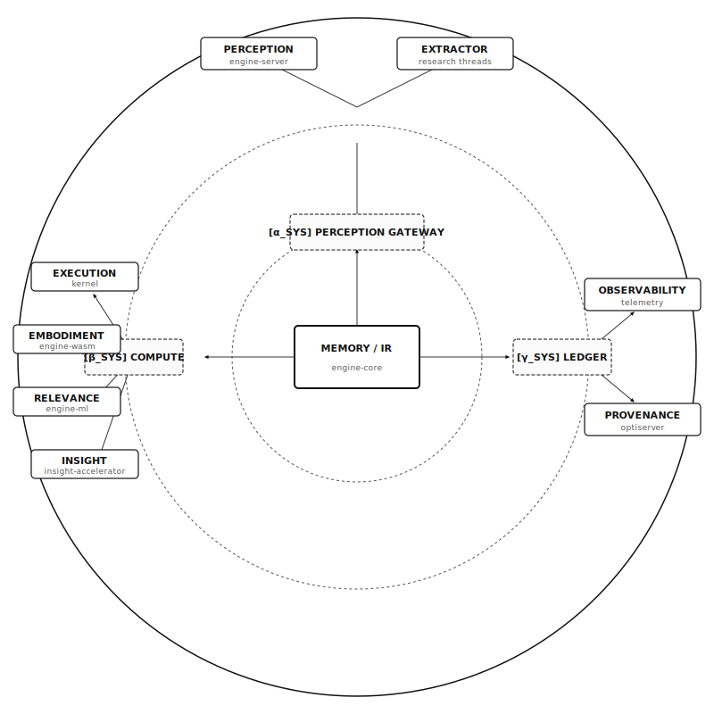

<div align="center">

<!-- Banner -->
<picture>
  <source media="(prefers-color-scheme: dark)" srcset="public\assets\visuals\information_topology_banner_dark.png">
  <source media="(prefers-color-scheme: light)" srcset="public\assets\visuals\information_topology_banner_light.png">
  
</picture>

<!-- Badges -->
<p align="center">
  
  
</p>

</div>

---

# Scientific Intelligence Substrate

Grove is a high-concurrency, sovereign scientific discovery substrate engineered in Rust, leveraging computational infrastructure for resilient scientific organizations. This system executes literature triangulation, epistemic filtering, and data extraction over text payloads scaling up to 120,000 tokens while enabling data sovereignty via a bare-metal microkernel boundary.

## TL;DR

A Rust-native scientific intelligence substrate for resilient, local-first research operations; The system combines asynchronous inference orchestration, graph-structured scientific memory, reproducible data pipelines, and minimized external data exposure model routing into a modular architecture for high-leverage research micro-teams. Integrating open-weight models, automated literature ingestion, and hybrid symbolic/neural workflows, the engine-core investigates how computational infrastructure can amplify scientific iteration speed while reducing institutional overhead and operational fragility.

## Core Thesis

> Massive scale breeds fragility; minimal footprint yields resilience.

Modern computation dramatically reduces the minimum viable scale required for advanced scientific operations. Open-weight models, cloud infrastructure, adaptive modular pipelines, and global scientific literature access enable research at more compressed scales, that previously required large institutional coordination layers. One strong systems architecture can amplify an entire organization. If a technical paradigm shifts, a micro-lab can rewrite its automated pipeline over a weekend.  

## Formalism

The system is modeled as a retrieval-conditioned state transition system over a persistent graph-structured memory space, where execution evolves distributed state via graph-retrieved action policies and deterministic transition dynamics.

## Systems Direction

- Scientific intelligence substrate for structured knowledge representation and long-horizon reasoning.
- Reproducibility as a first-class constraint across data ingestion, inference, and evaluation pipelines.
- Local-first compute with tiered routing across on-device execution, cluster resources, and external model endpoints.
- Hybrid symbolic–neural workflows integrating graph-based representations with learned models for inference and retrieval.

### Architecture and Execution Lineage

The Grove engine is organized as a lineage-preserving, deterministic research execution stack. Each subsystem owns a distinct transformation boundary of ingestion, routing, reasoning, simulation, or orchestration, allowing provenance, reproducibility, and execution semantics to remain explicit across the entire pipeline.

#### Ingress Boundary: `engine-server` 

An event-driven Axum-based HTTP layer responsible for acquiring, streaming, and transforming external datasets (e.g., FineWeb-Edu, FinePDFs) into structured research artifacts and visualization outputs (D3.js, Obsidian-compatible Markdown). Prior to any UTF-8 conversion, inbound payload bytes are hashed to generate immutable SHA-256 identifiers, exposed through `x-payload-sha256` headers to establish dataset provenance and lineage at the point of entry.

#### Token Gateway: `engine-ml`

A token-aware inference and routing layer implementing BPE-based context accounting (`cl100k_base`), concurrent caching (`DashMap`), and multi-tier model execution across local and remote endpoints. All content traverses a strict validation pipeline enforced through `RouterAuditEnvelope`, while a hard pre-routing ceiling (`FALLBACK_CHUNK_WORD_LIMIT = 24_999`) guarantees bounded execution and deterministic chunking behavior before downstream processing.

#### Epistemic Matrix: `engine-core` 

The primary reasoning substrate and typed scientific object registry. It defines structured research contracts such as `TopicNode`, `ResearchThreadObject`, and `ScientificHypothesisNode`, with shared serialization semantics across native and WebAssembly targets. Core analytical operations include structural intersections, conceptual overlap detection, and graph reasoning. These operations execute through pure Rust data structures (HashSet, typed collections), eliminating runtime Python dependencies from the mathematical execution path.

#### Simulation Twin: `engine-wasm`

A browser-compatible execution target exposing a constrained, deterministic subset of `engine-core`. Compiled for `wasm32-unknown-unknown`, it enables interactive visualization, lightweight inference, and research graph exploration while maintaining execution parity with native implementations. Operating within browser-isolated execution environments, it provides a deterministic simulation twin free from native operating-system call dependencies.

#### Deterministic Runtime Substrate: `engine-kernel`

A `#![no_std]` Rust kernel (`x86_64-unknown-none`) implementing coroutine scheduling through `KernelFiber` and lock-free communication primitives via `KernelChannel`. The kernel provides capability-oriented isolation boundaries, deterministic scheduling semantics, and foundational execution primitives for future distributed or embedded deployments.

#### Lineage Orchestrator: `optiserver`

An asynchronous Python ASGI orchestration layer responsible for coordinating execution workflows, lineage tracking, experiment state management, and long-running analytical processes. Results are persisted through append-only JSONL logs, ensuring auditability, crash recovery, and replayability while allowing visualization layers such as Streamlit to remain stateless.

### System Invariant

Together, these components form a strict functional transformation pipeline:

**Dataset Ingestion → Provenance Capture → Token Routing → Epistemic Computation → Simulation/Visualization → Lineage Persistence**

Each stage exposes explicit contracts, preserves transformation history, and minimizes cross-layer coupling, enabling reproducible scientific workflows, deterministic execution paths, and future self-improving research loops.

## Architecture Overview

<p align="center">
  <picture>
    <source media="(prefers-color-scheme: dark)" srcset="docs/assets/hyperbolic_architecture_dark.svg">
    <source media="(prefers-color-scheme: light)" srcset="docs/assets/hyperbolic_architecture.svg">
    
  </picture><br>
  <sub><b>Figure 1: Poincaré Disk Projection of the Architecture</b> Nodes radiate from the central core across three main branches, compressing exponentially toward the perimeter. This layout demonstrates how complex terminal runtimes are structurally contained without cluttering the primary execution path.</sub>
</p>

## Technical Specifications

- **Bare-Metal Isolation:** engine-kernel compiles under strict x86_64-unknown-none with zero standard-library (no_std) dependencies. Enforces object-level capabilities and atomic snapshots at the system boundary.

- **Persistent Research State:** Operates via structured asynchronous coroutines (Research Threads) that manage execution context, inference traces, and iterative reasoning steps across long-horizon execution context loops.

- **Dynamic Inference Routing:** Automated gateway (engine-ml/src/dynamic_router.rs) audits payload sizes using native tiktoken-rs cl100k_base() BPE token counting. Payload execution routing paths map directly to:

   - **Local Sovereignty Path ($\le$ 40,000 tokens):** Dispatched via OLLAMA_ENDPOINT directly to local GPU hardware.

   - **Deep Context Path (40,000 to 120,000 tokens):** Offloaded via SERVERLESS_ENDPOINT to high-context serverless providers such that it prevents local VRAM thrashing. Hard rejections are enforced for payloads exceeding the 120k limit.

- **Automated Resilience Fallback:** If the serverless route encounters connection timeouts, HTTP status failures, or DNS drops, the engine intercepts the error using an implicit match block, logs a warning via eprintln!, and activates local chunked compression. It fragments the stream into chunks bounded by a strict FALLBACK_CHUNK_WORD_LIMIT = 24_999 and processes them sequentially over the local GPU before merging outputs.

- **Structured Epistemic Filtering:** Eliminates code duplication by standardizing shared serde primitives (TopicNode { what, who, next_step } and CorrespondenceGraph { nodes }) in engine-core/src/correspondence.rs.

- **Zero-Copy Serialization Path:** The web interface handler (engine-server/src/main.rs) converts raw inbound POST HTTP Bytes into un-cloned &str references, forwarding text arrays directly to the inference layer to avoid heap fragmentation.

- **Institutional-scale dataset ingest:** Features an in-memory, zero-dependency Apache Parquet stream deserializer (engine-server/src/hf_ingest.rs) targeting structured, PII-scrubbed datasets like FineWeb-Edu and FinePDFs via authenticated HTTP range requests. It automatically binds source document hashes to extracted topic nodes to maintain complete data provenance.

- **Sanitized Embedded Visualizations:** Exposes a GET route /api/v1/viz/network-graph that reads from the append-only SQLite lineage database and exports formatted topological JSON manifests under kernel_store/visualizations. Filenames are dynamically scrubbed of slashes, whitespace, and query parameters using safe underscore sanitization.

- **Cross-Target Platform Uniformity:** Native storage requirements (rusqlite) are strictly gated away from WebAssembly blocks, ensuring that engine-core and engine-wasm compile smoothly under wasm32-unknown-unknown for web implementations.

## Quick Start

```bash
cargo build --release --workspace
cargo run --release -p engine-server
```

Ingest → stream → visualize:

```bash
POST /api/v1/ingest
GET  /api/v1/viz/network-graph
```

## Project Metadata

- **License:** Apache License 2.0, copyright 2025 IO Lab. See `LICENSE` and `NOTICE`.
- **Security:** Maintainers with write access are expected to enable GitHub two-factor authentication. See `.github/SECURITY.md`.
- **Sponsors:** GitHub Sponsors is configured through `.github/FUNDING.yml`; details live in `.github/SPONSORS.md`.

### Attribution

Visual diagram and images produced through a collaborative synthesis of author-led conceptual sketches plus GPT-5.5/Image 2.0 reasoning.

### Research Directions 

* Retrieval-based reasoning over persistent graph-structured memory states
* Automated experimentation as state evolution on typed execution graphs
* Literature triangulation across heterogeneous knowledge sources
* Collective intelligence as distributed scientific reasoning systems
