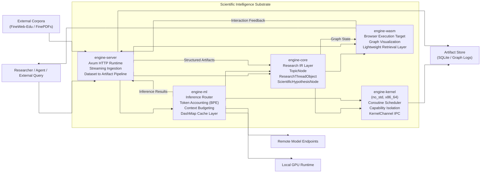

<div align="center">

<!-- Banner -->
<picture>
  <source media="(prefers-color-scheme: dark)" srcset="public\assets\visuals\information_topology_banner_dark.png">
  <source media="(prefers-color-scheme: light)" srcset="public\assets\visuals\information_topology_banner_light.png">
  
</picture>

<!-- Badges -->
<p align="center">
  
  
</p>

</div>

---

# Scientific Intelligence Substrate

Grove is a high-concurrency, sovereign scientific discovery substrate engineered in Rust, leveraging computational infrastructure for resilient scientific organizations. This system executes literature triangulation, epistemic filtering, and data extraction over text payloads scaling up to 120,000 tokens while enabling data sovereignty via a bare-metal microkernel boundary.

Scientific intelligence = structured graph + constrained execution + distributed routing + persistent traceability

## TL;DR

A Rust-native scientific intelligence substrate for resilient, local-first research operations; The system combines asynchronous inference orchestration, graph-structured scientific memory, reproducible data pipelines, and minimized external data exposure model routing into a modular architecture for high-leverage research micro-teams. Integrating open-weight models, automated literature ingestion, and hybrid symbolic/neural workflows, the engine-core investigates how computational infrastructure can amplify scientific iteration speed while reducing institutional overhead and operational fragility.

## Core Thesis

> Massive scale breeds fragility; minimal footprint yields resilience.

Modern computation dramatically reduces the minimum viable scale required for advanced scientific operations. Open-weight models, cloud infrastructure, adaptive modular pipelines, and global scientific literature access enable research at more compressed scales, that previously required large institutional coordination layers. One strong systems architecture can amplify an entire organization. If a technical paradigm shifts, a micro-lab can rewrite its automated pipeline over a weekend.  

## Formalism

The system is modeled as a retrieval-conditioned state transition system over a persistent graph-structured memory space, where execution evolves distributed state via graph-retrieved action policies and deterministic transition dynamics.

## Systems Direction

- Scientific intelligence substrate for structured knowledge representation and long-horizon reasoning.
- Reproducibility as a first-class constraint across data ingestion, inference, and evaluation pipelines.
- Local-first compute with tiered routing across on-device execution, cluster resources, and external model endpoints.
- Hybrid symbolic–neural workflows integrating graph-based representations with learned models for inference and retrieval.

## Architecture Topology

- **`engine-kernel`**: A `#![no_std]` Rust core (`x86_64-unknown-none`) implementing coroutine scheduling (`KernelFiber`) and lock-free message/correspondence channels (`KernelChannel`). Designed around capability-based isolation primitives and deterministic execution boundaries.

- **`engine-core`**: A typed research object registry defining structured scientific data contracts (`TopicNode`, `ResearchThreadObject`, `ScientificHypothesisNode`) with shared serialization semantics across native and `wasm32-unknown-unknown` targets.

- **`engine-ml`**: An inference routing and token-aware scheduling layer implementing BPE-based context accounting (`cl100k_base`), concurrent caching strategies (`DashMap`), and multi-tier execution routing across local and remote model endpoints.

- **`engine-server`**: An event-driven Axum-based HTTP layer that streams and transforms external dataset shards (e.g., FineWeb-Edu, FinePDFs) into structured research artifacts and visualization outputs (D3.js, Obsidian-compatible Markdown).

- **`engine-wasm`**: A browser-compatible execution target exposing a constrained subset of `engine-core` for interactive visualization, lightweight inference, and research graph exploration.

## Architecture Overview


```mermaid
flowchart LR

%% =========================
%% Core System Boundary
%% =========================

User[Researcher / Agent / External Query]

subgraph Engine["Scientific Intelligence Substrate"]

direction TB

Kernel["engine-kernel\n(no_std, x86_64)\nCoroutine Scheduler\nCapability Isolation\nKernelChannel IPC"]

Core["engine-core\nResearch IR Layer\nTopicNode\nResearchThreadObject\nScientificHypothesisNode"]

ML["engine-ml\nInference Router\nToken Accounting (BPE)\nContext Budgeting\nDashMap Cache Layer"]

Server["engine-server\nAxum HTTP Runtime\nStreaming Ingestion\nDataset to Artifact Pipeline"]

WASM["engine-wasm\nBrowser Execution Target\nGraph Visualization\nLightweight Retrieval Layer"]

end

%% =========================
%% External Systems
%% =========================

Cloud["Remote Model Endpoints"]
Local["Local GPU Runtime"]
Datasets["External Corpora\n(FineWeb-Edu / FinePDFs)"]
Storage["Artifact Store\n(SQLite / Graph Logs)"]

%% =========================
%% Data / Control Flow
%% =========================

User --> Server

Server --> Core
Server --> ML

ML --> Local
ML --> Cloud
ML --> Core

Datasets --> Server

Core --> Kernel
ML --> Kernel

Kernel --> Storage
Server --> Storage

Core --> WASM
Server --> WASM

WASM --> User

%% =========================
%% Feedback Loops
%% =========================

ML -->|Inference Results| Server
Server -->|Structured Artifacts| Core
Core -->|Graph State| WASM
WASM -->|Interaction Feedback| Server

%% =========================
%% Orthogonal Edge Routing
%% =========================

linkStyle default interpolate stepBefore
```

## Technical Specifications

- **Bare-Metal Isolation:** engine-kernel compiles under strict x86_64-unknown-none with zero standard-library (no_std) dependencies. Enforces object-level capabilities and atomic snapshots at the system boundary.

- **Persistent Research State:** Operates via structured asynchronous coroutines (Research Threads) that manage execution context, inference traces, and iterative reasoning steps across long-horizon execution context loops.

- **Dynamic Inference Routing:** Automated gateway (engine-ml/src/dynamic_router.rs) audits payload sizes using native tiktoken-rs cl100k_base() BPE token counting. Payload execution routing paths map directly to:

   - **Local Sovereignty Path ($\le$ 40,000 tokens):** Dispatched via OLLAMA_ENDPOINT directly to local GPU hardware.

   - **Deep Context Path (40,000 to 120,000 tokens):** Offloaded via SERVERLESS_ENDPOINT to high-context serverless providers such that it prevents local VRAM thrashing. Hard rejections are enforced for payloads exceeding the 120k limit.

- **Automated Resilience Fallback:** If the serverless route encounters connection timeouts, HTTP status failures, or DNS drops, the engine intercepts the error using an implicit match block, logs a warning via eprintln!, and activates local chunked compression. It fragments the stream into chunks bounded by a strict FALLBACK_CHUNK_WORD_LIMIT = 24_999 and processes them sequentially over the local GPU before merging outputs.

- **Structured Epistemic Filtering:** Eliminates code duplication by standardizing shared serde primitives (TopicNode { what, who, next_step } and CorrespondenceGraph { nodes }) in engine-core/src/correspondence.rs.

- **Zero-Copy Serialization Path:** The web interface handler (engine-server/src/main.rs) converts raw inbound POST HTTP Bytes into un-cloned &str references, forwarding text arrays directly to the inference layer to avoid heap fragmentation.

- **Institutional-scale dataset ingest:** Features an in-memory, zero-dependency Apache Parquet stream deserializer (engine-server/src/hf_ingest.rs) targeting structured, PII-scrubbed datasets like FineWeb-Edu and FinePDFs via authenticated HTTP range requests. It automatically binds source document hashes to extracted topic nodes to maintain complete data provenance.

- **Sanitized Embedded Visualizations:** Exposes a GET route /api/v1/viz/network-graph that reads from the append-only SQLite lineage database and exports formatted topological JSON manifests under kernel_store/visualizations. Filenames are dynamically scrubbed of slashes, whitespace, and query parameters using safe underscore sanitization.

- **Cross-Target Platform Uniformity:** Native storage requirements (rusqlite) are strictly gated away from WebAssembly blocks, ensuring that engine-core and engine-wasm compile smoothly under wasm32-unknown-unknown for web implementations.

## Quick Start

```bash
cargo build --release --workspace
cargo run --release -p engine-server
```

Ingest → stream → visualize:

```bash
POST /api/v1/ingest
GET  /api/v1/viz/network-graph
```

### Research Directions 

* Retrieval-based reasoning over persistent graph-structured memory states
* Automated experimentation as state evolution on typed execution graphs
* Literature triangulation across heterogeneous knowledge sources
* Collective intelligence as distributed scientific reasoning systems

### Attribution

Visual diagram and images produced through a collaborative synthesis of author-led conceptual sketches plus GPT-5.5/Image 2.0 reasoning.
